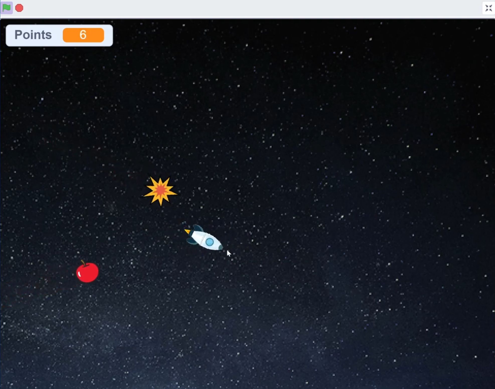
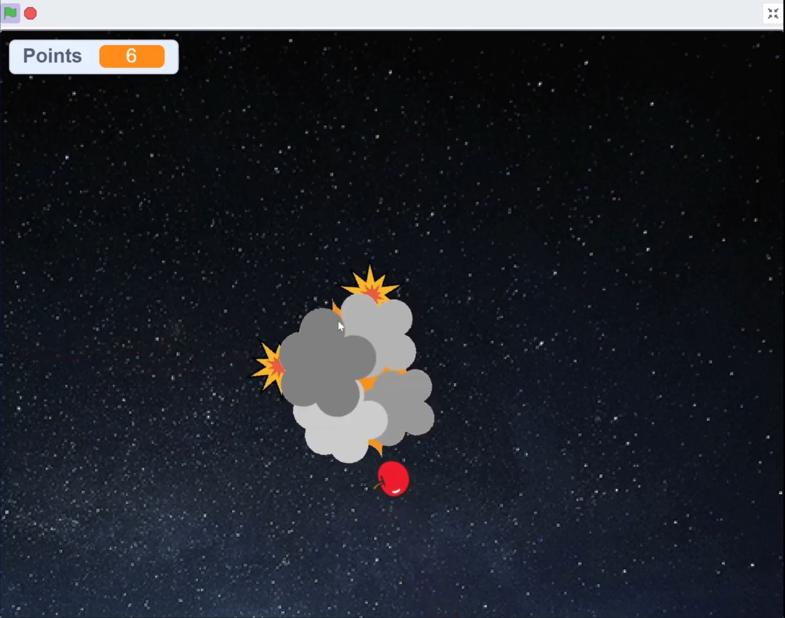
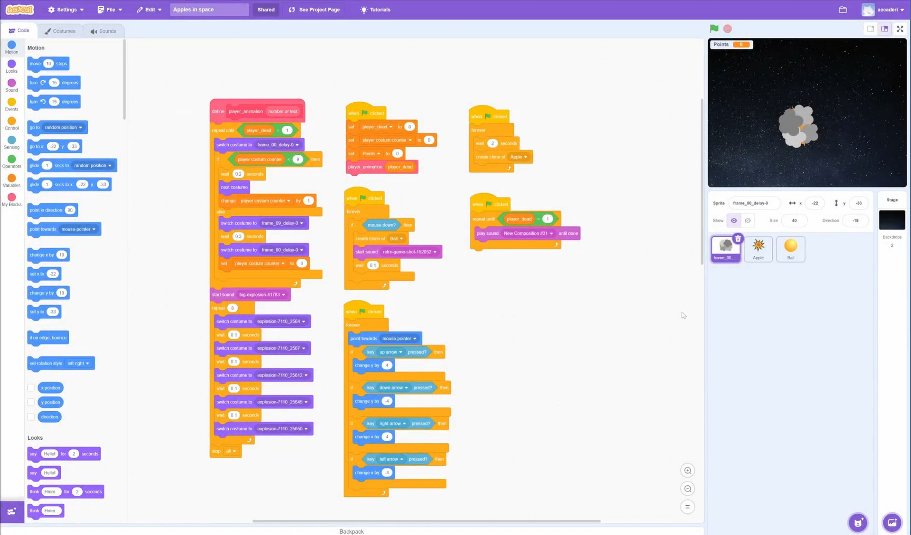

<h1 align="center"> 
  Apples in space -Scratch mini-game
   
</h1>

<h4 align="center">Quick space game using basic scratch functions and tools.</h4>

Full video link: <a href="https://youtu.be/CZMjZ0w11zw">https://youtu.be/CZMjZ0w11zw</a>

Scratch profile: <a href="https://scratch.mit.edu/users/accaderi/">https://scratch.mit.edu/users/accaderi/</a>

## The mini-game

Objective:  
The player controls a spaceship using the arrow keys to move and the mouse to aim. The player can shoot at apple asteroids by clicking the left mouse button.

## Notes

The game includes straightforward while loops and if/else statements, along with basic animations and music.